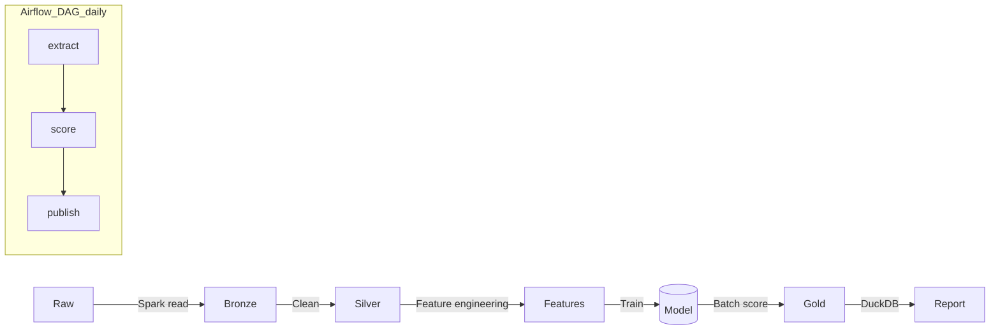

# End-to-End Fraud Detection Pipeline for Subscription Payments
*Machine Learning for Subscription-Payment Fraud Detection (Local Spark + Airflow)*

## ▸ Problem Statement
Subscription (recurring) payments create a steady attack surface for fraud: repeated micro-transactions, balance games, and subtle behaviors that blend into normal churn. Manual review doesn’t scale past a few thousand rows.

This pipeline delivers a fully local, end-to-end solution using PySpark + LightGBM + Airflow, which ingests ~6.3M transactions, engineers subscription-aware features, trains a classifier, and scores daily batches so risk teams can triage the top 0.5–1% highest-risk payments first.

✦ This project showcases my expertise in **data engineering** (PySpark, Airflow, Parquet), **ML for fraud** (LightGBM, class-imbalance handling), and **analysis at rest** (DuckDB/SQLite) - all runnable locally.

---
## ▸ Data Sources & Collection
- Dataset: Kaggle - Online Payments Fraud (6.3M labeled transactions).

- Lakehouse Layers (Parquet)
  - **Bronze** → raw → columnar (`data/bronze/`)
  - **Silver** → cleaned + typed + engineered (`data/silver/` - e.g., `delta_bal`, `is_weekend`)
  - **Gold** → batch scores for analytics (`data/gold/scores.parquet`)

---
## ▸ ML Pipeline Overview



Feature snapshots (initial):
`step`, `amount`, `oldbalanceOrg`, `newbalanceOrig`, `delta_bal`, `type_* (ohe)`, `is_weekend`, `hour_of_day`, simple rolling stats (7–30d) where feasible; class imbalance handled by scale_pos_weight.

Airflow Graph (successful run):


---
## ▸ Results
Latest local run (**LightGBM**, time-aware split):
- **ROC-AUC**: 0.99
- **PR-AUC**: 0.97
- **Precision @ top 0.5%**: ~0.968
- **Recall @ top 0.5%**: ~0.73

✦ Reviewing only **0.5%** of transactions (highest scores) catches **~73%** of all fraud at **~97%** precision — an effective operating point for analyst teams.

<div align="center">   </div>

**HTML Report KPIs (sample):**


*(All charts and KPIs are generated from data/gold/scores.parquet.)*

---
## ▸ Quick Start
```python

# Step 1 - Python env
python -m venv .venv && source .venv/bin/activate 
pip install -r requirements.txt

# Step 2 - End-to-end (first run trains + scores)
python -m fraudflow.cli run-all --csv-path ./data/raw/PS_20174392719_1491204439457_log.csv

# Step 3-  Daily scoring (after model exists)
python -m fraudflow.cli score

# Step 4 - Browse results without Spark (DuckDB on Parquet)
python - <<'PY'
import duckdb
print(duckdb.sql("""
  SELECT step, amount, oldbalanceOrg, newbalanceOrig, score
  FROM 'data/gold/scores.parquet'
  ORDER BY score DESC
  LIMIT 20
""").df())
PY
```

Airflow :-
```python
# terminal A
airflow db init
airflow webserver -p 8080

# terminal B
airflow scheduler

# trigger a run
airflow dags trigger fraudflow_local
# open http://localhost:8080 → DAG: fraudflow_local

```
---
## ▸ Business Impact

- **Chargeback reduction**: Surface the worst 0.5–1% of transactions for human review before settlement, lowering refund/chargeback costs.
- **Analyst efficiency**: Route analysts to high-precision queues first, reduce manual review volume by **~99.5%** while catching **~97%** of fraud at the **0.5%** setting.
- **Faster interdiction**: Shorter time-to-flag = fewer repeat fraud attempts on the same instrument/subscription.
- **Cash-flow protection**: Early detection prevents repeated “balance games” across cycles.
- **Auditability & reproducibility**: Parquet + SQL outputs and HTML reports provide transparent, repeatable evidence for policy tuning.

---
## ▸ ML Evaluation
- **Split**: time-aware (train on earlier steps, validate on later steps)
- **Imbalance**: `scale_pos_weight = N_neg / N_pos` (LightGBM)
- **Metrics**: ROC-AUC, PR-AUC, Precision/Recall @ K%
- **Artifacts**: model → `artifacts/model.lgb`; scored table → `data/gold/scores.parquet`; KPIs → `reports/metrics.html`

✦ **Operating point**: start with **Top 0.5%** review rate; adjust to analyst capacity.

---
 ## ▸ Skills & Tools

- 
  Orchestrates @daily **extract → transform → train → score → publish**.
- 
  Distributed I/O, feature engineering, and Parquet Bronze/Silver/Gold layers.
- 
  Gradient-boosted trees with `scale_pos_weight` for heavy imbalance.
-  + 
  Fast local analytics on Parquet and lightweight KPI store.
- 
  Zero-copy columnar interchange; Parquet read/write.
- 
  Metrics (ROC/PR, precision/recall@k) and utilities.
- 
  Clean CLI: `fraudflow.cli run-all`, `score`, `report`.
- 
  Typed settings/config for paths & knobs.
- 
  One notebook (`notebooks/01_browse_scores.ipynb`) for quick exploration.
- 
  (Optional) CI for lint/format/tests.
-  
  Convenience targets to run Spark and Airflow locally.


---
## ▸ Repo Layout

fraudflow-local  
├── src/fraudflow/   -  Spark session, IO, schemas, features, model, eval, pipeline, CLI  
├── dags/  -  Airflow DAG (fraudflow_local)  
├── data/   -  bronze/ silver/ gold (gitignored)  
├── artifacts/          - model.lgb (gitignored)  
├── reports/          - metrics.html / sqlite (gitignored)   
├── assets/                - screenshots  
├── examples/               - small sample parquet for quick browsing  
└── README.md                       - Project overview  


---


## ▸ Future Work
- Add device/geo/velocity signals, calibrate thresholds, and probability calibration.
- Model registry + experiment tracking, and streaming (Kafka) for near-real-time scoring.
- Hardening: drift checks, feature store, canary runs, and alerting.

ⓘ Disclaimer
This is a local educational pipeline on a public dataset.
Production deployment requires additional signals, governance, monitoring, and privacy controls.

---
## ▸ Contributing
Issues and pull requests are welcome!  

By submitting a pull request, you confirm that:
- You wrote the code or have the right to contribute it.
- You grant the repository owner a perpetual, worldwide, non-exclusive, royalty-free license to use, modify, and distribute your contribution as part of this project.
- You understand that, since there is no explicit code license, third-party reuse of the project’s code outside this repository is not permitted.

Please open an issue first for major changes and keep PRs focused. Do not commit third-party data unless it complies with the “Data Source and Licensing” section.

---
## ▸ About Me
I am a data enthusiast passionate about using AI to understand human trends. This project reflects my journey in blending technology with real-world impact. Connect with me on [LinkedIn](https://www.linkedin.com/in/godha-naravara/) or explore more at my [GitHub](https://github.com/godhanaravara)!